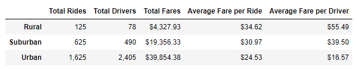
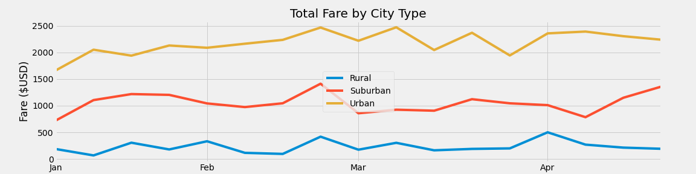

# PyBer Analysis

## Overview of Project:

Using python code, pandas and matplotlib to perform an analysis of ride-sharing data by city type.  Analysis results are shown in summary tables and a total fares by city type  multiple line graph.

### Purpose:

Python code and pandas are used to perform an analysis of Pyber's ride-sharing data.  This allows for quick processing and analysis of large data sets to develop summary tables to communicate findings and develop visualizations.  Summary table for the ride-sharing data by city type and a total fares by city type graph were developed.  

While processing the data set, the three city types included are Urban, Suburban, and Rural.  Two data sets were merged to provide complete driver, ride, fare, and city type information.  One data set is composed of ride data for calendar year 2019 and the second data set is composed of city data including type classifications (e.g. urban, suburban, or rural) where city names are common between the two data sets for the merge.

## Analysis Results and Challenges:

### Analysis of Outcomes 

For the city data, the highest count of cities was in the urban type with the lowest count being in the rural type.  The number of cities included in the urban type is approximately 3.7 times more cities than in the rural type and approximately 1.8 times more cities than in the suburban type.

-- Total rides by city type: Between the three city types, the urban cities have the most total rides in 2019.  In comparison, urban cities had approximately 13 times more total rides than rural cities and approximately 2.6 times more total rides than suburban cities. 

-- Total drivers by city type: Between the three city types, as expected, the urban cities have the most total drivers.  In comparison, urban cities had approximately 30.1 times more total drivers than rural cities and approximately 4.9 times more total drivers than suburban cities.

-- Total fares by city type: Because the urban city type had the most number of total rides, it also had the highest total fare.  In comparison, urban cities had approximately 9.2 times higher total fare than rural cities and approximately 2 times higher total fare than suburban cities.

-- Average fare per ride by city type: Even though the urban city type has the highest total fare sum, because it also has the highest number of rides, the average fare per ride was the lowest.  The highest average fare per ride is in the rural city type.  The rural city type average fare per ride is approximately 1.4 times higher than the urban city type and approximately 1.1 times higher than the suburban city type.

-- Average fare per driver by city type:  With the highest number of drivers and the lowest average fare per ride, the urban city type also has the lowest average fare per driver even though the urban cities have the highest number of rides. The rural city type average fare per driver is the highest.  The rural average fare per driver is approximately 3.3 times higher than the urban city type and approximately 1.4 times higher than the suburban city type.

#### Ride, Driver, and Fare breakdown by City Type

    

Total fare tracked per week for January through April 2019 by city type:  As summarized above, the fare total by city type graph shows that urban cities have the highest fare total with rural cities the lowest and suburban cities in the middle.  Additionally, as noted above, the total fare between city types is distinctly different and do not intersect (order of magnitude difference). The disparity between city types exists at various levels, in addition to total fare, such as with total rides, total drivers, and average fare.

#### Fare Total by City Type

### Challenges and Difficulties Encountered

No challenges were encountered during the analysis. But assumptions or additional actions that needed to be made include:

* Following merge of the ride data and city data, any "NaN" cells were not removed, replaced, or cleansed from the merged, overall data set.

* Additional data on ride distances and more detailed statistics on rides and drivers beyond average (e.g. maximum, minimum, and mode) would be able to further define if particular areas within each city type are more successful than others, if certain drivers are more successful than others, and if there is there is an optimal number of rides per driver or distance per ride.

## Summary

Based on the data findings, the following business recommendation options are proposed to address the disparities between the city types:

1. To increase the average fare per driver in the urban city type, a possible option is to reduce the number of drivers.  There are 3.7 times more urban cities than rural cities, but there are approximately 30 times more drivers in urban cities than in rural cities. Though this increases the number of rides performed in urban cities, it decreasing the average fare per driver which in turn diminishing the driver's work motivation as they must take on even more rides to narrow the disparity with suburban and rural drivers.

2. If fare is based on ride time and distance, the average fare per ride suggests rural rides are longer or greater distance when compared to the urban city type average. Although urban city rides are approximately 13 times higher in count when compare to rural cities, urban cities need to increase the ride total further to close the average fare per driver disparity between urban and rural city types.  Performing a combination of both recommendations 1 and 2 will have the greatest impact.

3. Based on the total fare by city type graph, the month of March was volatile for urban cities and a slower period for suburban and rural city types.  Increasing the number of rides in rural and suburban city types and having a more consistent number of rides for the urban city type will help to further reduce the disparity between the city types.  Increasing the number of rides for suburban and rural cities could be accomplished by adding more drivers based on the concept that more drivers will increase driver availability to conduct more rides for these city types. 
